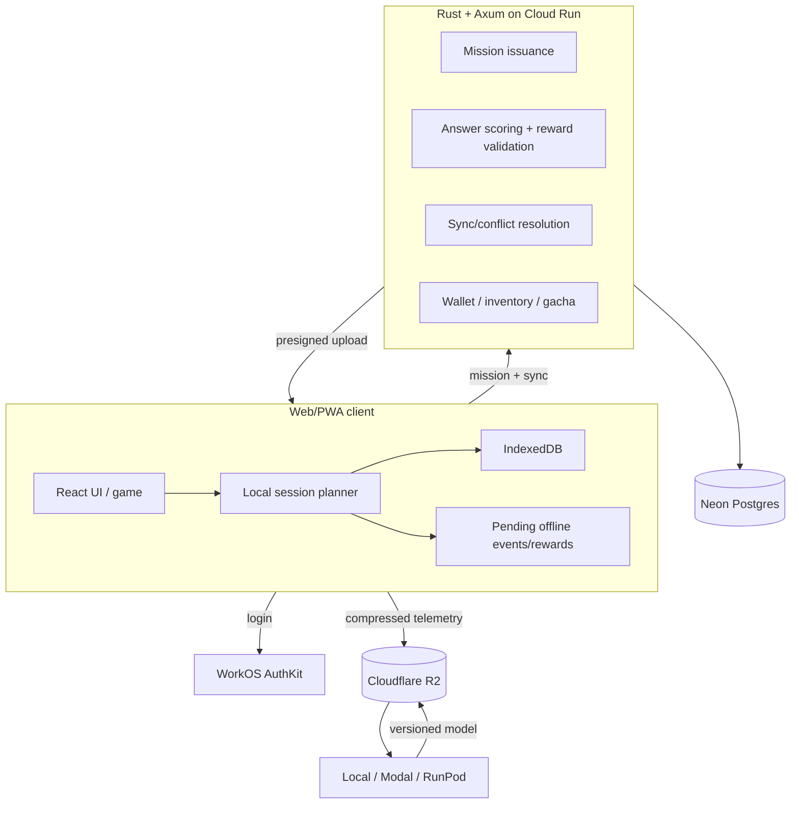
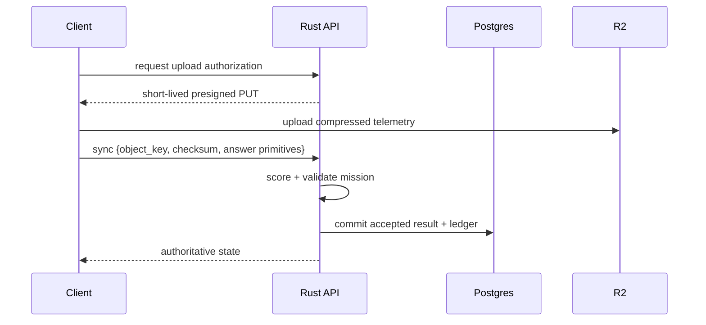

# System Architecture

## Decision

Use a **local-first study client with server-authoritative missions, scoring, and economy**.



## Why local-first

Do not send every drag, animation, or node movement to the API.

Target per study session:

- 1 mission/bootstrap request
- 0 requests for ordinary puzzle manipulation
- 1 sync/reconciliation request
- separate calls only for authoritative actions such as gacha

Benefits:

- low cloud cost
- low interaction latency
- offline tolerance
- less backend load

## Why the server still owns learning evidence used for rewards

A modified client can fabricate `score=1.0`. Therefore the client must not submit a final reward claim.

The server issues a frozen `mission_instance`:

```text
mission_instance_id
user_id
content_version
question_ids
reward_policy_version
knowledge_snapshot_version
issued_at
expires_at
nonce
```

The client submits answer primitives:

```text
question_id
selected nodes / ordering / tokens
attempt number
hint actions
event_id
device_id
occurred_at
```

The server:

1. loads canonical answer/content version
2. re-scores the answer
3. computes reward from the pre-mission state
4. applies anti-farming rules
5. commits accepted learning result + wallet ledger atomically

Offline rewards remain **pending** until reconciliation.

## Trust model

| State | Source of truth |
|---|---|
| wallet | Postgres ledger |
| inventory | Postgres |
| gacha result | server transaction |
| mission definition | server/content version |
| raw client telemetry | R2; untrusted until accepted |
| accepted learning history | server acceptance records + referenced telemetry |
| learner snapshot | derived/cache |
| local animation/puzzle state | client |

If answer keys are downloaded to the client, a determined user can inspect them. V1 anti-cheat is deterrence suitable for non-transferable study-game currency, not proof of human learning.

## Multi-device and offline sync

Every interaction contains:

```text
event_id UUID
device_id
device_sequence
mission_instance_id
occurred_at
```

Rules:

- raw learning events are append-only and deduplicated by `event_id`
- concept state is derived from accepted events; clients do not overwrite it blindly
- wallet/inventory never use last-write-wins
- offline spending is restricted or reserved server-side
- mutable snapshots use a version/ETag for optimistic concurrency

### Conflict policy

| State | Conflict rule |
|---|---|
| learning events | append + deduplicate |
| concept state | recompute/merge from accepted events |
| wallet | append-only server ledger |
| inventory | server transaction |
| campaign progress | monotonic/validated merge |
| preferences | optimistic last-write with version |
| discovery progress | monotonic set-union (never removes a reveal) |

### Batched auxiliary state

Discovery persistence, recommendation lifecycle telemetry, and other auxiliary
events share the existing `POST /v1/sync` request instead of adding one request
per reveal or per event:

```json
{
  "events": ["authoritative scored attempts"],
  "discovery_updates": ["optional Knowledge Map deltas"],
  "auxiliary_events": ["optional recommendation telemetry"]
}
```

Each section has its own disposition. The authoritative `events` section commits
first; the optional sections are processed separately and are **not** placed in
one atomic transaction. A failure in an auxiliary section never rejects or rolls
back accepted learning events, and the client retains only the failed auxiliary
work for a later retry. Auxiliary work is flushed at natural boundaries
(dashboard open, mission sync, Daily Mission transitions, returning online) with
no polling timer.

## API

**Rust + Axum + Tokio.**

Reasons:

- native Rust; no WASM dependency
- low memory/CPU overhead
- Tokio/Hyper/Tower ecosystem
- standard OCI container; portable to another host

Use **SQLx** for PostgreSQL. Keep SQL explicit and avoid a heavy ORM.

## API surface

```text
POST /v1/missions/issue
POST /v1/missions/:id/answers
POST /v1/sync
GET  /v1/tracks/:id/discovery
POST /v1/tracks/:id/recommendation
POST /v1/tracks/:id/recommendations/:rid/events
POST /v1/tracks/:id/session
POST /v1/tracks/:id/daily-mission
POST /v1/daily-missions/:id/items/:position/start
POST /v1/daily-missions/:id/items/:position/complete
GET  /internal/model-evaluation
POST /v1/uploads/authorize
POST /v1/gacha/roll
POST /v1/game/action
PUT  /v1/goals/:id
GET  /v1/content/manifest
GET  /v1/models/manifest
```

Avoid a generic per-drag API.

## Raw telemetry upload

V1 may proxy small batches through the API. At higher volume:



Training consumes only R2 objects referenced by accepted records.

## Cross-language contract

Use Rust structs as the API source of truth:

1. generate OpenAPI from Rust
2. generate TypeScript client/types
3. validate contract generation in CI

## Architecture principles

- standard HTTP + PostgreSQL + S3-compatible storage + OCI containers
- batch operations over fine-grained writes
- no microservices initially
- add queues/caches only from measured need
- model deployment is separate from application deployment
