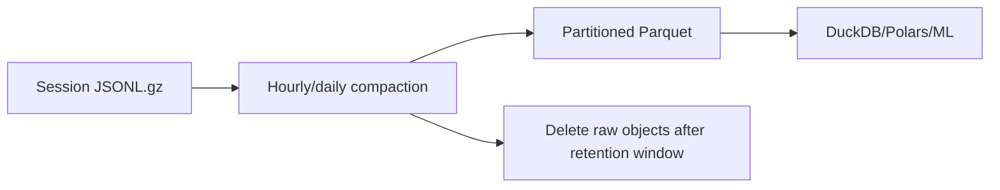

# Data and Storage Architecture

## Storage split

Use storage by access pattern.

| Data | Store | Why |
|---|---|---|
| users, goals | Postgres | transactional relational state |
| current learner snapshot | Postgres | frequent per-user reads |
| wallet/inventory | Postgres | strong consistency |
| gacha ledger | Postgres | auditability/idempotency |
| campaign progress | Postgres | relational state |
| mission/acceptance records | Postgres | authoritative learning/economy evidence |
| raw client telemetry | R2 | append-heavy, cheap storage |
| compacted Parquet/Iceberg | R2 | training/analytics |
| models | R2 | immutable artifacts |
| certification bundles | R2/static CDN (target); embedded in the API build today | cacheable/versioned |
| game media (art, audio, video) | R2 `app-assets` + CDN | cheap delivery; too large for the web bundle |
| local session cache | IndexedDB | offline/local-first |

> Current implementation note: certification and learning content is discovered
> under `content/` and embedded into the API binary at build time
> (`crates/content/build.rs`), then validated when the registry loads. Content is
> never fetched per request. Moving versioned bundles to R2/static CDN remains
> the target for content that should not ship in the API image.

## PostgreSQL schema

Minimum entities:

```text
users
certification_catalog
certification_versions
objectives
concepts
concept_edges
questions
question_concepts
user_goals
mission_instances
accepted_answers
user_concept_state
campaign_state
sync_batches
devices
device_wallets
bit_transactions
user_wallets
wallets
wallet_ledger
inventory
gacha_rolls
model_versions
recommendation_log
deletion_tombstones
```

## Learner snapshot

`user_concept_state` is a derived/cache representation, not ground truth.
Accepted `learning_events` remain authoritative, so the cache can be rebuilt
from them at any time.

One row exists per `(user, certification version, concept, assessment mode)`, so
recognition, recall, application, and structural reconstruction stay separate
evidence signals instead of being averaged into one number.

```text
user_id
certification_version
concept_id
assessment_mode
estimate               # bounded [0, 1]
evidence_mass          # accumulated weighted evidence; more mass decays slower
exposure_count
success_count
failure_count
last_practiced_at
last_success_at
model_version          # "heuristic-v1"
state_version          # monotonic per-row revision
updated_at
```

Do not accept blind client replacement of this row. Forgetting/retrievability is
computed on read at selection time from `evidence_mass` and
`last_practiced_at`; stored state is never aged by a background job.

## Auxiliary recommendation history

`recommendation_log` records which optional recommendations were shown to a
learner so planner quality can be reviewed later. It is deliberately **not**
learning evidence: it never feeds scoring, rewards, concept state, or mastery.
Writes are best-effort — a missing table, an unreachable database, or a
constraint failure must never fail a recommendation or a learning session.

Ownership is user-based: `mission_instances`, `learning_events`, and wallet
state carry an owning `user_id`. `device_wallets` is the legacy pre-auth table
and is retained only for audit; new settlements go to `user_wallets`. Rows
written before authentication existed have a NULL `user_id` and are excluded
from every user-scoped query rather than being attributed to a guessed account,
because a bare `device_id` is not a secure account-claim credential.

## Raw event schema

Preserve rich evidence:

```json
{
  "event_id": "uuid",
  "device_id": "uuid",
  "device_sequence": 812,
  "mission_instance_id": "uuid",
  "user_id": "uuid",
  "question_id": "q_123",
  "concept_ids": ["attention.query", "attention.key"],
  "difficulty_prior": 0.6,
  "assessment_mode": "relationship_recall",
  "interaction_type": "node_connection",
  "answer_payload": {"edges": [["q", "k"]]},
  "response_ms": 8400,
  "attempt": 2,
  "hints": 0,
  "occurred_at": "..."
}
```

The authoritative score/reward is produced server-side and stored in `accepted_answers`.

## Raw telemetry trust

An object in R2 is not automatically valid training data.

Training data is built from:

```text
accepted mission/answer records
+
R2 telemetry referenced by those records
+
abuse/data-quality filters
```

## R2 layout

```text
app-assets/
  v000001/                     # immutable asset-set version
    manifest.json              # logical id -> key, checksum, metadata
    art/companion/<id>.webp
    art/buildings/<id>.webp
    audio/sfx/<id>.ogg
    audio/music/<id>.ogg
    ui/icons/<id>.webp

raw-events/
  year=2026/month=09/day=18/<batch>.jsonl.gz

compacted/
  year=2026/month=09/day=18/part-*.parquet

models/
  memory/v000023/model.json
  memory/v000023/manifest.json

content/
  aws/dop-c02/v005/bundle.json
```

Game media is staged locally under `assets/` (gitignored; see
`assets/README.md`) and synced to the `app-assets` bucket. Bump the asset-set
version instead of overwriting published objects, serve them from an R2 public
domain behind Cloudflare with immutable caching, and never proxy media bytes
through Cloud Run. Small app-shell assets (icon, favicon) stay in the web bundle
and are served as static assets.

## Compaction

Millions of tiny session objects become an operations and analytics problem.

Pipeline:



Keep raw objects long enough for recovery/audit, then delete after successful compaction.

## Analytics

Initial:

```text
R2 Parquet
-> DuckDB / Polars
-> Python notebooks/training
```

If remote SQL becomes useful, migrate selected datasets to **Apache Iceberg tables in R2 Data Catalog**, then query with R2 SQL.

Do not describe R2 SQL as querying arbitrary loose Parquet files.

## Deletion and privacy

Shared Parquet partitions make immediate physical deletion expensive.

Use two stages.

### Immediate logical deletion

- delete/disable live account state in Postgres
- add `deletion_tombstone(user_id, requested_at, version)`
- all dataset builders exclude tombstoned users immediately
- record tombstone-filter version in each training snapshot

### Background physical deletion

- find affected raw/compacted partitions
- rewrite partitions without deleted users
- delete superseded objects
- record completion

Do not create one object per user solely for deletion convenience.

## Trained-model deletion policy

Document whether deletion requires retraining previously trained shared models. This is a policy/legal decision; do not imply automatic removal from an already-trained model unless implemented.

## Retention

Suggested defaults:

- live account/learner state: while account exists
- wallet/gacha ledger: according to legal/accounting needs
- raw telemetry: bounded retention before compaction
- compacted learning history: long-lived if privacy policy permits
- diagnostic logs: short retention
- model artifacts: production + rollback + selected reproducibility checkpoints
