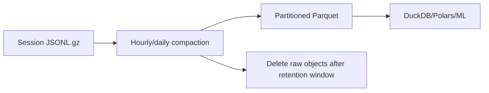

# Data and Storage Architecture

## Storage split

Use storage by access pattern.

| Data | Store | Why |
|---|---|---|
| users, goals | Postgres | transactional relational state |
| current learner snapshot | Postgres | frequent per-user reads |
| wallet/inventory | Postgres | strong consistency |
| gacha ledger | Postgres | auditability/idempotency |
| campaign progress | Postgres | relational state |
| mission/acceptance records | Postgres | authoritative learning/economy evidence |
| raw client telemetry | R2 | append-heavy, cheap storage |
| compacted Parquet/Iceberg | R2 | training/analytics |
| models | R2 | immutable artifacts |
| certification bundles | R2/static CDN | cacheable/versioned |
| game media | Cloudflare static/R2 | cheap delivery |
| local session cache | IndexedDB | offline/local-first |

## PostgreSQL schema

Minimum entities:

```text
users
certification_catalog
certification_versions
objectives
concepts
concept_edges
questions
question_concepts
user_goals
mission_instances
accepted_answers
user_concept_state
campaign_state
sync_batches
devices
wallets
wallet_ledger
inventory
gacha_rolls
model_versions
deletion_tombstones
```

## Learner snapshot

`user_concept_state` is a derived/cache representation, not ground truth.

```text
user_id
concept_id
recognition_estimate
recall_estimate
application_estimate
reconstruction_estimate
last_practiced_at
last_success_at
exposure_count
success_count
failure_count
model_version
state_version
updated_at
```

Do not accept blind client replacement of this row.

## Raw event schema

Preserve rich evidence:

```json
{
  "event_id": "uuid",
  "device_id": "uuid",
  "device_sequence": 812,
  "mission_instance_id": "uuid",
  "user_id": "uuid",
  "question_id": "q_123",
  "concept_ids": ["attention.query", "attention.key"],
  "assessment_mode": "relationship_recall",
  "interaction_type": "node_connection",
  "answer_payload": {"edges": [["q", "k"]]},
  "response_ms": 8400,
  "attempt": 2,
  "hints": 0,
  "occurred_at": "..."
}
```

The authoritative score/reward is produced server-side and stored in `accepted_answers`.

## Raw telemetry trust

An object in R2 is not automatically valid training data.

Training data is built from:

```text
accepted mission/answer records
+
R2 telemetry referenced by those records
+
abuse/data-quality filters
```

## R2 layout

```text
raw-events/
  year=2026/month=09/day=18/<batch>.jsonl.gz

compacted/
  year=2026/month=09/day=18/part-*.parquet

models/
  memory/v000023/model.json
  memory/v000023/manifest.json

content/
  aws/dop-c02/v005/bundle.json
```

## Compaction

Millions of tiny session objects become an operations and analytics problem.

Pipeline:



Keep raw objects long enough for recovery/audit, then delete after successful compaction.

## Analytics

Initial:

```text
R2 Parquet
-> DuckDB / Polars
-> Python notebooks/training
```

If remote SQL becomes useful, migrate selected datasets to **Apache Iceberg tables in R2 Data Catalog**, then query with R2 SQL.

Do not describe R2 SQL as querying arbitrary loose Parquet files.

## Deletion and privacy

Shared Parquet partitions make immediate physical deletion expensive.

Use two stages.

### Immediate logical deletion

- delete/disable live account state in Postgres
- add `deletion_tombstone(user_id, requested_at, version)`
- all dataset builders exclude tombstoned users immediately
- record tombstone-filter version in each training snapshot

### Background physical deletion

- find affected raw/compacted partitions
- rewrite partitions without deleted users
- delete superseded objects
- record completion

Do not create one object per user solely for deletion convenience.

## Trained-model deletion policy

Document whether deletion requires retraining previously trained shared models. This is a policy/legal decision; do not imply automatic removal from an already-trained model unless implemented.

## Retention

Suggested defaults:

- live account/learner state: while account exists
- wallet/gacha ledger: according to legal/accounting needs
- raw telemetry: bounded retention before compaction
- compacted learning history: long-lived if privacy policy permits
- diagnostic logs: short retention
- model artifacts: production + rollback + selected reproducibility checkpoints
