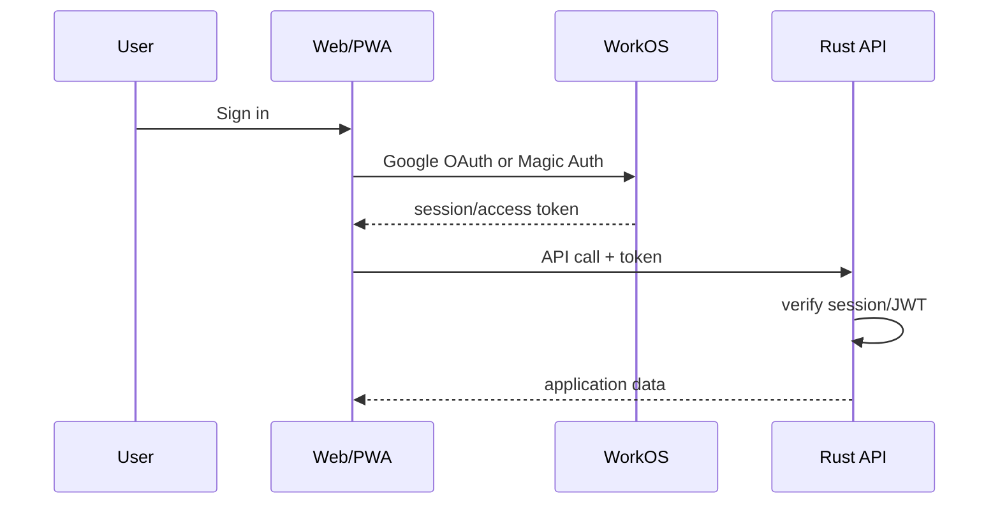

# Authentication

## Decision

Use **WorkOS AuthKit**.

Initial methods:

1. Google OAuth.
2. Passwordless Magic Auth: 6-digit one-time email code.
3. No password login in V1.

WorkOS currently provides AuthKit free up to 1M MAU and has official React and Rust SDKs.

## Implementation status

Authentication is implemented. The API verifies WorkOS AuthKit access tokens
and derives ownership from the verified internal `users.id`, never from a
client-supplied `device_id`.

- `apps/api/src/auth.rs` holds the token verifier and the `AuthenticatedUser` /
  `OptionalUser` extractors. Routes never parse JWTs themselves.
- Signature verification uses the provider JWKS at
  `https://api.workos.com/sso/jwks/<clientId>`. Keys are cached with a TTL and
  refreshed when an unknown `kid` appears, so no WorkOS call happens on the hot
  path. `exp`, `iss`, and the `client_id` claim are validated. WorkOS access
  tokens identify the application with `client_id` rather than `aud`, so
  `client_id` is checked explicitly.
- The first authenticated request upserts a `users` row keyed by
  `(auth_provider, auth_subject)` using the partial unique index, so concurrent
  first logins resolve to one account. Email is profile data, not identity: it
  comes from a one-time provider profile lookup when the account has none yet,
  a changed email updates the existing row, and it never creates a second
  account.
- `device_id` survives as device/install/session context (`devices` table and
  telemetry columns). It is never an authorization boundary.
- Protected routes: `POST /v1/missions/issue` (scored modes),
  `POST /v1/missions/{id}/answers`, `POST /v1/missions/{id}/complete`,
  `POST /v1/sync`, `GET /v1/wallet`, `GET /v1/me`, and
  `GET /v1/certifications/{certification_id}/domains/{domain_id}/learning`
  (pre-quiz knowledge-map content).
- Public routes: `GET /health`, `GET /openapi.json`, and
  `GET /v1/certifications` (the catalog). Anonymous task-practice missions are
  allowed only for the `*-demo` certification and never settle Bits.

### Local development without credentials

`APP_ENV=local` or `test` without WorkOS configuration enables an explicit
`Authorization: Bearer dev:<subject>` mode. It is impossible to enable
accidentally in staging or production: those environments fail startup unless
`WORKOS_CLIENT_ID` and `WORKOS_API_KEY` are set. There is no `X-User-Id` header
and no production bypass. On the web side, `VITE_WORKOS_CLIENT_ID` selects the
official AuthKit SDK; without it the **Continue as local developer** option is
offered on `/login` in dev builds and on localhost hostnames (including a
production build served with `vite preview`), or anywhere with an explicit
`VITE_AUTH_DEV_MODE=true`.

### Testing real Google sign-in locally

The Google button only appears when `VITE_WORKOS_CLIENT_ID` is set, so it is
absent in a clone without WorkOS credentials by design. To test the real flow:

1. Create a WorkOS **Staging** environment (it can use WorkOS's default Google
   credentials, so no Google Cloud project is required) and an AuthKit
   application. Note the `client_...` id and `sk_test_...` key.
2. In the WorkOS dashboard:
   - Applications → Redirects: `http://localhost:5173` and initiate login URI
     `http://localhost:5173/login`.
   - Authentication → allowed origins: `http://localhost:5173`. This is
     required and easy to miss: the callback exchanges the code with a browser
     `fetch` to `api.workos.com`, so a missing origin fails the exchange (a CORS
     error in the console) even though Google itself succeeded.
   - Authentication → OAuth providers → Google: enable it.
3. Set `WORKOS_CLIENT_ID` and `WORKOS_API_KEY` in the root `.env`, and
   `VITE_WORKOS_CLIENT_ID` in `apps/web/.env.local`.
4. Restart both servers. `/login` then shows **Continue with Google**; the local
   developer option disappears and `dev:` tokens are rejected (the modes are
   mutually exclusive).

If `GET /v1/me` returns 401 after the redirect, it is almost always an issuer or
client-id mismatch: set `WORKOS_ISSUER` to the exact `iss` claim (the default is
`https://api.workos.com`) and make sure the API and web client ids match.
`VITE_WORKOS_API_HOSTNAME` supports a custom AuthKit authentication domain.

The post-login redirect is handled client-side through React Router (not a full
page reload). The AuthKit SDK only persists the session across reloads on
`localhost`/`127.0.0.1`, so a forced reload on any other host would drop the
session and leave the UI looking signed out. If the header still shows “Sign in”
after Google, open the browser console: a `[auth]` warning means the OAuth code
could not be exchanged, usually because the registered redirect URI does not
exactly match `window.location.origin` or sign-in was not started from the app.

## Why code instead of magic link

WorkOS recommends Magic Auth codes and has deprecated Magic Links because enterprise mail security tools can automatically open links and invalidate them.

Source: <https://workos.com/docs/authkit/modeling-your-app>

## Flow



## Login UI

Default options:

```text
Continue with Google
--------------------
or
Email address
[ Send code ]
```

Do not force account creation before a learner can inspect the product. Consider anonymous/local demo mode, then require auth for cloud sync.

## Identity model

Postgres should use an internal UUID.

```text
users
  id                UUID PK
  auth_provider     "workos"
  auth_subject      WorkOS user id UNIQUE
  email
  created_at
```

Never use email as the primary key.

## Account linking

Let the auth provider handle identity linking where possible. Avoid custom Google/email account merge logic.

WorkOS identity linking documentation: <https://workos.com/docs/authkit/identity-linking>

## Session security

Define one supported SPA session flow and test it end-to-end.

Requirements:

- HTTPS only in production.
- Hosted OAuth/PKCE/state handling through WorkOS SDK/AuthKit flow.
- Validate issuer/audience/signature on API tokens.
- Cache/fetch JWKS according to provider guidance.
- Use provider-supported refresh/session handling; do not invent token refresh logic.
- Prefer secure/httpOnly cookie handling where the selected WorkOS flow supports it; otherwise keep browser token exposure minimal and documented.
- Explicit logout/revocation flow.
- Custom auth domain before production if practical.
- Do not place WorkOS API secret in the frontend.
- Never log access/refresh tokens.
- Rotate secrets after suspected exposure.

## Authorization

Authentication answers **who** the user is.

The Rust API still enforces:

- resource ownership
- admin permissions
- entitlement/subscription state
- server-authoritative wallet/inventory operations

## Abuse controls

Add:

- IP/user rate limits for sync and gacha
- idempotency keys
- replay protection for economic actions
- bot protection on signup if abuse appears

Do not add SMS login initially; it adds cost and abuse risk.

## References

- AuthKit overview: <https://workos.com/docs/authkit/overview>
- Magic Auth: <https://workos.com/docs/authkit/magic-auth>
- Social login: <https://workos.com/docs/authkit/social-login>
- React SDK: <https://workos.com/docs/sdks/authkit-react>
- Rust SDK: <https://workos.com/docs/sdks/rust>
- Sessions: <https://workos.com/docs/authkit/sessions>
- Pricing/environment limits: <https://workos.com/docs/authkit/environments>
