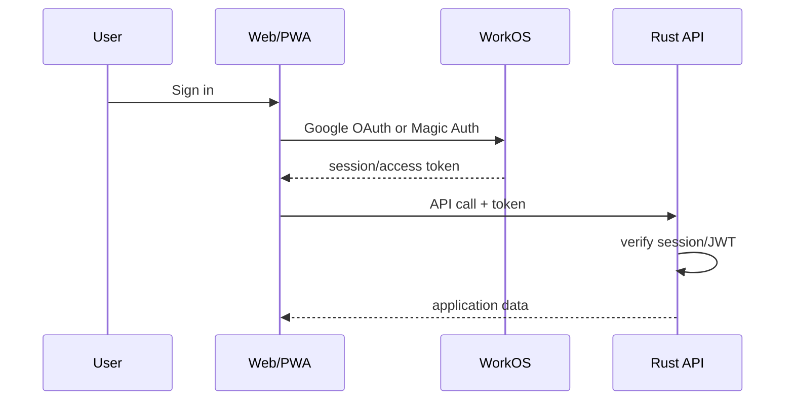

# Authentication

## Decision

Use **WorkOS AuthKit**.

Initial methods:

1. Google OAuth.
2. Passwordless Magic Auth: 6-digit one-time email code.
3. No password login in V1.

WorkOS currently provides AuthKit free up to 1M MAU and has official React and Rust SDKs.

## Phase 0 status

Phase 0 defines the configuration boundary only. `WORKOS_CLIENT_ID`,
`WORKOS_API_KEY`, and optional `WORKOS_ISSUER` are loaded and validated at API
startup (`apps/api/src/config.rs`), and are required to be set together or not
at all. No route requires a token and no auth middleware is installed yet.
Token verification, JWKS handling, and the first authenticated route arrive with
the first protected endpoint in a later phase.

## Why code instead of magic link

WorkOS recommends Magic Auth codes and has deprecated Magic Links because enterprise mail security tools can automatically open links and invalidate them.

Source: <https://workos.com/docs/authkit/modeling-your-app>

## Flow



## Login UI

Default options:

```text
Continue with Google
--------------------
or
Email address
[ Send code ]
```

Do not force account creation before a learner can inspect the product. Consider anonymous/local demo mode, then require auth for cloud sync.

## Identity model

Postgres should use an internal UUID.

```text
users
  id                UUID PK
  auth_provider     "workos"
  auth_subject      WorkOS user id UNIQUE
  email
  created_at
```

Never use email as the primary key.

## Account linking

Let the auth provider handle identity linking where possible. Avoid custom Google/email account merge logic.

WorkOS identity linking documentation: <https://workos.com/docs/authkit/identity-linking>

## Session security

Define one supported SPA session flow and test it end-to-end.

Requirements:

- HTTPS only in production.
- Hosted OAuth/PKCE/state handling through WorkOS SDK/AuthKit flow.
- Validate issuer/audience/signature on API tokens.
- Cache/fetch JWKS according to provider guidance.
- Use provider-supported refresh/session handling; do not invent token refresh logic.
- Prefer secure/httpOnly cookie handling where the selected WorkOS flow supports it; otherwise keep browser token exposure minimal and documented.
- Explicit logout/revocation flow.
- Custom auth domain before production if practical.
- Do not place WorkOS API secret in the frontend.
- Never log access/refresh tokens.
- Rotate secrets after suspected exposure.

## Authorization

Authentication answers **who** the user is.

The Rust API still enforces:

- resource ownership
- admin permissions
- entitlement/subscription state
- server-authoritative wallet/inventory operations

## Abuse controls

Add:

- IP/user rate limits for sync and gacha
- idempotency keys
- replay protection for economic actions
- bot protection on signup if abuse appears

Do not add SMS login initially; it adds cost and abuse risk.

## References

- AuthKit overview: <https://workos.com/docs/authkit/overview>
- Magic Auth: <https://workos.com/docs/authkit/magic-auth>
- Social login: <https://workos.com/docs/authkit/social-login>
- React SDK: <https://workos.com/docs/sdks/authkit-react>
- Rust SDK: <https://workos.com/docs/sdks/rust>
- Sessions: <https://workos.com/docs/authkit/sessions>
- Pricing/environment limits: <https://workos.com/docs/authkit/environments>
