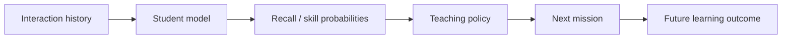

# Learning Engine

## Goal

Estimate what the learner can retrieve **now** and choose study actions that improve future retention.

These are separate problems:



A better predictor does not automatically imply a better teaching policy.

## Recognition is not recall

Record evidence mode explicitly.

Initial modes:

1. recognition
2. recall
3. application
4. structural reconstruction

Treat these initially as **assessment/evidence modes**, not proven independent latent abilities.

## Deterministic student state (`heuristic-v1`)

V1 ships a small, pure, deterministic state layer before any trained model. It is
deliberately named `heuristic-v1`, not "mastery".

- Accepted `learning_events` are authoritative. `user_concept_state` is a
  derived cache keyed by `(user, certification version, concept, assessment
  mode)`.
- A newly accepted event updates one cache row per authored
  `ConceptWeight`. Replayed/duplicate events never advance state twice, and
  anonymous demo attempts never create user state.
- The update is bounded and uses the server-scored partial score, the authored
  concept weight, the server-derived attempt number, hints, the assessment mode,
  and timestamps. Recovery attempts and hinted successes contribute less
  evidence than first-attempt, unaided successes.
- Retrievability/forgetting is computed **on read** at selection time from the
  stored evidence mass and last-practiced time. More evidence decays more slowly
  (stability grows with evidence mass), and stored rows are never aged in place.
- Constants live in `crates/domain/src/concept_state.rs` and are covered by
  unit tests. Persistence is `crates/db/src/concept_state.rs`.

The update function is intentionally replaceable: HLR/FSRS/DAS3H and prerequisite
remediation (joined through `KnowledgeNode::concept_ids`) can later replace it
without changing the storage contract or invalidating accepted history.

## Knowledge components

Each question maps to one or more concepts/skills with optional weights.

Example:

```text
PCA pipeline boss
imputation     0.10
encoding       0.15
scaling        0.20
PCA            0.25
KMeans         0.20
data leakage   0.10
```

## Interaction features

Record:

```text
learner
question
concepts
assessment mode
interaction type
score / partial score
structured errors
response time
attempts
hints
item difficulty
spacing/history features
```

### Response-time safeguards

Response time is noisy.

- pause/background time when detectable
- log-transform durations
- cap/winsorize extreme values
- do not equate slow response with weak knowledge without context

## Model roadmap

### Baselines

Benchmark all three before deep KT:

1. **HLR** — interpretable forgetting baseline
2. **FSRS** — mature engineering baseline for single-item spaced repetition
3. **DAS3H-style model** — multi-skill + temporal forgetting

FSRS is not the final product model because it does not directly model multi-concept technical problems or rich error structure; it is a useful scheduler/memory baseline.

### Later candidates

Only after substantial real data:

- DKT/RNN
- AKT
- LefoKT or other forgetting-aware KT
- content-aware models such as KARL-like approaches

Adopt a deep model only if it materially improves the app's own held-out data and downstream teaching outcomes.

## Student-model evaluation

Primary:

- Brier score
- log loss
- calibration plots / ECE
- AUC secondary

Evaluation matrix:

| Split | Tests |
|---|---|
| within-user temporal holdout | normal future prediction |
| new-user holdout | cold start |
| new-item holdout | unseen questions |
| new-concept holdout | concept generalization |
| certification holdout | cross-domain transfer |
| mode slices | recognition vs recall etc. |

Avoid random row splits that leak future behavior.

## Teaching-policy evaluation

Do not auto-promote a scheduler because the predictor's Brier score improved.

Measure:

- delayed recall
- learning gain per minute
- exam-objective coverage
- review burden
- voluntary return rate
- learner override rate

Use online experiments when enough traffic exists.

## Scheduling utility

Candidate utility may combine:

```text
forgetting risk
* exam objective weight
* prerequisite value
* uncertainty/information gain
* transfer value
* variety penalty
```

Then satisfy session constraints such as duration and interaction diversity.

## V1 planner (optional, deterministic)

The first planner is a small pure function, `PlannerInput -> Recommendation`,
implemented in `apps/api/src/planner.rs`. It is track-agnostic: a Learning Track
may be a vendor certification or a general track such as Python Fluency, Python
Data Stack, or PyTorch Core. It never hard-codes an exam or vendor.

Actions:

- `learn_node` — study a knowledge-map node the learner has not explored.
- `review_node` — revisit a node for a strong but stale concept.
- `practice_question` — answer a retrieval-practice question.
- `practice_domain` — take a domain/topic review.

Stable reason codes explain each choice: `cold_start`, `weak_concept`,
`weak_prerequisite`, `needs_practice`, `stale_knowledge`, `domain_review`, and
`strong_and_fresh`. Rules are evaluated in a fixed order, so identical input
produces an identical recommendation:

```text
cold start
-> weak prerequisite before a weak dependent concept
-> weak, unexplored node with little evidence
-> weak, already-explored concept -> retrieval practice
-> strong but stale concept -> review
-> strong and fresh -> harder/applied practice or a domain review
```

Inputs are the derived `heuristic-v1` concept state, recent accepted events,
question `ConceptWeight`/assessment mode/difficulty, knowledge nodes and their
module/node prerequisites, and optional client discovery progress. Assessment
modes stay distinct: a practice candidate is scored against the state for the
question's own mode, so strength in recognition never hides weakness in
application.

### Discovery semantics match the Knowledge Map

Discovery means "I revealed/explored learning material", not "I demonstrated
knowledge". It never creates a `learning_event`, concept-state evidence, a quiz
score, or Bits.

Raw discovery progress is sent with the recommendation request
(`POST /v1/tracks/{track_id}/recommendation`). The server derives unlocked nodes
and completed modules with the same rules the frontend Knowledge Map uses
(`crates/content/src/discovery.rs`): a module is available only when every
prerequisite module is **complete** (every node unlocked), and a node is
available only when its module is available and every node prerequisite is
unlocked. The planner never targets a node the map still shows as locked.

#### Local-first, server-persisted discovery

The Knowledge Map is local-first: it renders from `localStorage` immediately and
never waits for the server. Persisted discovery (`discovery_progress`) is fetched
asynchronously and **unioned** into local progress; a failure is ignored and the
map keeps working from local state. Reveals stay enabled even when discovery
persistence is down.

Server merging is a monotonic set-union:

```text
server prompts  = server prompts  ∪ incoming prompts
server elements = server elements ∪ incoming elements
```

An older device can never remove a newer reveal, duplicate batches are harmless,
and concurrent multi-device writes are serialized per `(user, track, domain)` by a
row lock, so there is no last-write-wins conflict. Node/module state is always
derived on read, never stored as a second source of truth.

Planners use the best state available:

```text
persisted server discovery ∪ fresh discovery in the current request
```

so a just-revealed node does not need to wait for discovery sync before the next
explicit planning request understands it. Daily Missions remain immutable once
generated: newly synced discovery never regenerates today's mission, though it can
inform tomorrow's.

### Executing a recommendation

- `learn_node` / `review_node` open the exact recommended Knowledge Node.
- `practice_question` starts a focused `recommended_practice` mission. The
  server validates the anchor question against canonical content, places it
  first, and selects the related questions itself from authored concept overlap
  (deterministic, repeat-aware). The client never supplies the related ids.
- `practice_domain` starts the normal adaptive `domain_quiz`.

Existing Quick Quiz, Domain Quiz, Full Practice, and Task Practice behavior is
unchanged.

### Lifecycle telemetry

Each recommendation carries a stable `recommendation_id`. Generation is logged
when the recommendation is computed; lifecycle stages (`shown`, `clicked`,
`started`, `node_opened`, `completed`) are queued locally and delivered in
batches, piggybacked on `/v1/sync` as `auxiliary_events` (or via the direct
`POST /v1/tracks/{track_id}/recommendations/{recommendation_id}/events`). A
recommendation request is never treated as proof it was shown.

Telemetry is idempotent: every event carries a stable `event_id`, so a retried
batch cannot insert it twice. Telemetry may arrive late; it is never
authoritative, and losing it entirely does not affect learning.

All recommendation and telemetry persistence is auxiliary and best-effort. It
never shares a transaction with learning-event persistence, and a failure can
never block the dashboard, knowledge maps, quizzes, mission creation, answer
submission, or sync. Only accepted, scored learning events change concept state.

### Eventual consistency and request reduction

Recommendations are advisory and do not need real-time freshness. The client
caches the current recommendation for the relevant context and only refreshes at
meaningful boundaries (opening the Learning Track dashboard, completing a Daily
Mission, entering a new day, or an explicit refresh). A reveal or answer never
triggers another recommendation request, and temporary staleness is acceptable.

Auxiliary state (discovery deltas, recommendation telemetry, evaluation data) is
queued locally and flushed only at natural boundaries. There is no per-reveal
request, no per-telemetry request, and no polling timer. If the recommendation
API fails, the client hides the recommendation section and all study controls
remain available.

## V1 session planning

Beyond a single next action, the same concept model plans a short study session:
an ordered list of activities for a Learning Track. The pure core is
`planner::session::plan_session` (`apps/api/src/planner/session.rs`), exposed at
`POST /v1/tracks/{track_id}/session` with `available_minutes` and a preference
(`balanced`, `more_practice`, `more_learning`).

Activities reuse existing execution paths:

- `learn_node` / `review_node` open the exact Knowledge Node.
- `practice` carries server-selected `question_ids`; the client only anchors a
  `recommended_practice` mission on the first one. The client never submits
  arbitrary question ids.
- `practice_domain` starts the normal adaptive domain quiz.

V1 is deterministic. It orders learning/prerequisite activities before retrieval
and finishes with retrieval practice, balances weak concepts, forgetting risk,
difficulty fit, domain coverage, interaction variety, and recent-question
avoidance, and trims the plan to stay near the requested time. The single
"Recommended next" feature is unchanged and independent.

Session planning is optional. If the endpoint fails, times out, returns malformed
data, or returns nothing usable, the frontend builds a **standard non-adaptive
session** from already-loaded track content (domains in authored order, mixing
domain learning and practice). The fallback never calls the adaptive API and
never needs learner state, so a learner can always start a session. Adaptive
sessions can be adjusted with small planning overrides (shorter, more practice,
more learning, regenerate) that are preferences, not mastery evidence.

`study_session_log` records generated sessions as auxiliary telemetry; it is not
learning evidence and a persistence failure never prevents a session from being
returned.

## Daily Missions (V1)

The learner-facing plan is a single, stable **Daily Mission** per track and
canonical UTC day. It is generated once and stored immutably in
`daily_missions` / `daily_mission_items`; completing items, answering questions,
concept-state changes, refreshing, navigating away, or re-requesting the
endpoint never regenerate or reorder it. Tomorrow's mission is generated from
the learner's latest state.

Generation reuses the session planner (`planner::session::plan_session`) with a
roughly 20-minute, balanced plan, then persists the complete activity list and
position order, including the server-selected question ids for `practice`
activities. Activities are `learn_node`, `review_node`, `practice`, and
`domain_practice`.

Execution reuses existing primitives:

- `learn_node` / `review_node` are completed when the Knowledge Node reaches its
  normal completion condition, re-derived server-side from discovery progress.
  Opening the node alone does not complete it.
- `practice` / `domain_practice` start a normal mission whose completion marks
  the item complete. The client never chooses canonical question ids.

If adaptive generation fails when today's mission is first created, a
**standard non-adaptive** plan is generated from authored track content (domain
order, available learning nodes, domain practice), persisted with
`plan_type = standard`, and kept for the rest of the day. It never reads concept
state or adaptive APIs, and it is not silently replaced later.

Progress is server-authoritative and survives navigation, refresh, and
reopening the app; the runner resumes the first incomplete item. Completing all
items marks the mission complete and settles a single idempotent
`daily_mission_complete` Bits bonus (see `DAILY_MISSION_BONUS_BITS`), awarded at
most once even under retries or concurrent requests. Daily Mission completion is
never concept/mastery evidence; only scored learning events change knowledge
state.

## Measuring `heuristic-v1`

`heuristic-v1` remains the production model. This layer measures whether it
predicts future performance; it does not replace it.

- **Prediction before the answer.** When a question is issued, a prediction
  snapshot is persisted from the learner's concept state at that moment. It
  never reads the answer, the score, structured errors, response time, or
  post-answer state, so there is no target leakage.
- **Deterministic aggregation.** A question's predicted score is the
  authored-weight average of each concept's *current expected performance*. For a
  concept with stored state that is `estimate × retrievability`, so a concept the
  learner is likely to have forgotten is predicted lower than its stored estimate.
  The formula is deterministic, bounded to `[0, 1]`, documented, and unit tested;
  the stored concept state itself is never mutated by evaluation. A concept with
  no state in the question's assessment mode contributes the neutral prior, so
  recognition and recall stay separate. Per-concept detail (estimate, evidence
  mass, retrievability, uncertainty, forgetting risk) is stored for later
  analysis.
- **Outcome linkage.** When the accepted learning event arrives (immediately or
  after offline sync), it is linked to the prediction. The snapshot is never
  mutated and duplicates cannot double-link. Retry attempts are retained as
  operational data, but evaluation uses only the **first accepted attempt** for a
  question, so retries cannot inflate predictive samples. Abandoned questions
  simply have no outcome. `learning_events` remain authoritative for the actual
  score.
- **Metrics.** Pure functions compute Brier score, log loss, mean predicted and
  observed scores, and calibration buckets, with slices by assessment mode,
  source, track, domain, difficulty band, spacing, and delayed-retrieval flag.
  The internal aggregate-only endpoint (`/internal/model-evaluation`) exposes the
  summary and is **disabled outside local/test by default**; when enabled outside
  local/test it requires an explicit `X-Internal-Token`, so a normal learner token
  is never enough. No per-user analytics are surfaced in learner APIs. Later
  models (HLR, FSRS, DAS3H, deep KT) are benchmarked against this same
  prediction/outcome dataset.
- **Delayed retrieval.** Daily Missions may include at most one spaced
  retrieval item for a practiced concept whose `heuristic-v1` retrievability has
  decayed below a due threshold and whose spacing exceeds a minimum window.
  These items are tagged so analytics can separate delayed retrieval from
  immediate practice. This is a simple deterministic spacing heuristic, not
  FSRS/HLR.
- **Auxiliary and resilient.** Prediction, outcome, and analytics writes are
  best-effort and never share a transaction with mission issuance, answer
  acceptance, reward settlement, or concept-state updates. A measurement failure
  is logged and ignored; learning always continues.


Example:

> VPC routing moved ahead of IAM because IAM recall was stronger than predicted, while VPC troubleshooting has higher exam weight and increasing forgetting risk.

User can:

- accept
- choose lighter/harder alternative
- replace one activity
- keep original plan

## Learner quiz modes

The learner sees three quiz modes. Tactile interaction types are implementation
and scoring primitives underneath them, not learner-facing choices.

| Mode | Questions | Purpose |
|---|---:|---|
| Quick Quiz | 10 | adaptive cross-domain practice |
| Domain Quiz | ~20 | one exam domain, spread across tasks |
| Full Practice | 65 | weighted full-certification coverage |

V1 selection is an explainable heuristic (`apps/api/src/selection.rs`), not a
trained student model. It reads the derived per-concept state (estimate,
uncertainty, forgetting risk, evidence mass) and the authored `ConceptWeight`
mappings, then ranks candidates by concept weakness, forgetting risk, domain
weight, uncertainty, difficulty fit, novelty, and an immediate-repeat penalty,
with a deterministic question-id tie-break. Difficulty fit makes weak concepts
tend toward easier suitable questions and strong concepts toward harder ones.

Cold start falls back to accepted history when no derived state exists yet, then
to the neutral prior, so the modes still work for a brand-new learner. Quick Quiz
covers domains by official weight; Domain Quiz spreads across tasks; Full
Practice allocates seats by domain weight using a deterministic largest-remainder
method and redistributes any deficit when a domain is short. Question counts are
server policy and are never client input.

## Knowledge Signal (learner visualization)

The Track Hub visualizes progress through a coarse, non-judgmental
**Knowledge Signal**. It is explicitly not mastery: it never shows percentages,
pass probabilities, or negative labels.

Three independent dimensions are combined:

1. **Discovery** — whether the learner explored the node's learning content.
   Derived from discovery progress (never scored evidence): unexplored, explored,
   or completed.
2. **Evidence level** — how much scored evidence exists, from concept-state
   evidence mass: none, early, developing, or substantial. This is an amount of
   evidence, not a success claim; a node with little evidence looks early, not
   deficient.
3. **Freshness** — whether that evidence is still retrievable now, from
   `heuristic-v1` retrievability. It affects only the outer ring: fresh,
   becoming due, or review useful. A previously strong node never becomes dark
   or "lost" — it stays visibly learned and invites a refresh.

Assessment modes stay separate: each mode contributes its own small signal,
shown only in the node's hover/tap detail, never as permanent text on every
node. Unknown concepts look unexplored, not deficient.

The aggregate endpoint `GET /v1/tracks/{track_id}/progress` returns coarse
semantic states for every node in one request. States are derived
deterministically server-side (`apps/api/src/signals.rs`) from concept state,
evidence mass, retrievability, node → concept mappings, and discovery progress.
No raw model probabilities are exposed to the learner UI.

## Account-wide daily study streak

The streak spans **all** learning tracks: studying AWS today and Python tomorrow
continues the same streak. It is motivational, not learning evidence, and never
updates concept state.

A day qualifies when the learner has at least one **newly accepted scored
learning event**. Opening a page, clicking a node, revealing a card, viewing a
recommendation, loading a Daily Mission, and telemetry events never qualify.

Persistence is a small table of unique active days
(`user_study_days (user_id, local_day)`, unique), not a mutable counter, so the
current and longest streak are derived deterministically on read and duplicate
syncs/retries cannot advance the streak twice. The local day uses the learner's
persisted IANA timezone — the same boundary Daily Missions use — so a later
timezone change cannot farm extra days. The streak is bundled into `GET /v1/me`
so no separate request is needed.

The UI is compact and never punishing: an active day is illuminated, a pending
day is quiet, and a lapsed streak reads as "start a streak today" rather than
announcing a loss.

## Track Hub UX and study settings

The Learning Track hub is organized around one domain's Knowledge Map at a
time, with a compact domain switcher so the map never becomes an overwhelming
wall of nodes. Nodes align on their signal circle regardless of label length,
grow subtly on hover, and the recommended node carries a small "Next" marker
(explained in the map legend).

The Daily Mission is embedded in the hub as a view, using the same runner as the
standalone `/tracks/:id/daily` route (kept for deep links), so it no longer feels
like a separate page. Completed Daily Mission items can be **reviewed read-only**:
learning-node material is shown fully revealed with no clicks, and practice
questions are shown with their canonical answers and the learner's attempts via
`GET /v1/daily-missions/:id/items/:position/review` (or
`GET /v1/missions/:id/review`). Canonical answers are only returned after the
mission is complete, so in-progress work never leaks them.

### Guided order and unlocking

By default the hub presents a **guided, in-order path**: within a module, a node
becomes available only once every earlier node is complete, on top of the
existing module/node prerequisites. This reduces choice and is easier to focus
on. Learners who prefer freedom can enable **Unlock all study materials** in
study settings (`PUT /v1/me/settings`, also surfaced on the account page and in
the hub); the map then makes every node available while still presenting them in
content order. The setting is a preference only and never affects scoring,
evidence, concept state, or rewards.

## Request and caching strategy

The Track Hub is designed to keep HTTP traffic low and to fail open:

- one aggregate `GET /v1/tracks/{track_id}/map` for track-wide content, instead
  of one request per domain;
- one aggregate `GET /v1/tracks/{track_id}/progress` for the Knowledge Signal;
- the streak bundled into the already-loaded `GET /v1/me`;
- the recommendation and Daily Mission use their existing cached/eventual
  behavior.

Signals are cached in memory and refreshed only at meaningful boundaries
(opening the track, completing a quiz, an explicit refresh). There is no polling,
no per-node request, and no refetch after every answer. Temporary visual
staleness is acceptable.

Every enhancement loads independently. If the map, progress, streak,
recommendation, discovery sync, analytics, or telemetry fails, the dashboard,
Knowledge Map, learning nodes, Daily Mission, all quiz modes, answer submission,
sync, concept state, and Bits remain fully usable. The Knowledge Map renders from
local discovery progress alone when the signal is unavailable.

## Auxiliary failure isolation and batching

Auxiliary systems (discovery persistence, recommendation telemetry, prediction
measurement, calibration/analytics) are strictly non-authoritative. The
authoritative path is:

```text
learning events -> authoritative persistence -> concept state / Bits
```

Auxiliary work is performed **after** the authoritative operation commits, or, if
it must happen first for technical reasons, its failure is still swallowed.
Auxiliary writes never share a transaction with mission issuance, answer
acceptance, concept-state updates, Bits settlement, or Daily Mission completion.

`POST /v1/sync` carries optional sections in one request:

```json
{
  "events": ["..."],
  "discovery_updates": ["..."],
  "auxiliary_events": ["..."]
}
```

Each section has its own disposition. A failure in `discovery_updates` or
`auxiliary_events` never rejects or rolls back accepted `events`. The client
retains only the failed auxiliary section for a later retry; accepted learning
events are never resent because an auxiliary section failed. Sections are not
placed in one atomic database transaction. Malformed auxiliary entries are
dropped server-side, and queued telemetry is bounded (oldest dropped on
overflow), so a malformed or abusive client cannot grow the sync payload without
limit or block authoritative learning.

## Cold start: no diagnostic onboarding

There is no diagnostic or placement test. New learners study normally, and the
system accumulates evidence from ordinary quiz answers, Daily Missions, Knowledge
Map discovery, and spaced retrieval. Unknown concepts stay uncertain until
natural evidence accumulates; nothing forces an onboarding assessment.

## References

See [REFERENCES.md](REFERENCES.md).
