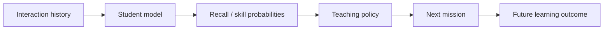

# Learning Engine

## Goal

Estimate what the learner can retrieve **now** and choose study actions that improve future retention.

These are separate problems:



A better predictor does not automatically imply a better teaching policy.

## Recognition is not recall

Record evidence mode explicitly.

Initial modes:

1. recognition
2. recall
3. application
4. structural reconstruction

Treat these initially as **assessment/evidence modes**, not proven independent latent abilities.

## Knowledge components

Each question maps to one or more concepts/skills with optional weights.

Example:

```text
PCA pipeline boss
imputation     0.10
encoding       0.15
scaling        0.20
PCA            0.25
KMeans         0.20
data leakage   0.10
```

## Interaction features

Record:

```text
learner
question
concepts
assessment mode
interaction type
score / partial score
structured errors
response time
attempts
hints
item difficulty
spacing/history features
```

### Response-time safeguards

Response time is noisy.

- pause/background time when detectable
- log-transform durations
- cap/winsorize extreme values
- do not equate slow response with weak knowledge without context

## Model roadmap

### Baselines

Benchmark all three before deep KT:

1. **HLR** — interpretable forgetting baseline
2. **FSRS** — mature engineering baseline for single-item spaced repetition
3. **DAS3H-style model** — multi-skill + temporal forgetting

FSRS is not the final product model because it does not directly model multi-concept technical problems or rich error structure; it is a useful scheduler/memory baseline.

### Later candidates

Only after substantial real data:

- DKT/RNN
- AKT
- LefoKT or other forgetting-aware KT
- content-aware models such as KARL-like approaches

Adopt a deep model only if it materially improves the app's own held-out data and downstream teaching outcomes.

## Student-model evaluation

Primary:

- Brier score
- log loss
- calibration plots / ECE
- AUC secondary

Evaluation matrix:

| Split | Tests |
|---|---|
| within-user temporal holdout | normal future prediction |
| new-user holdout | cold start |
| new-item holdout | unseen questions |
| new-concept holdout | concept generalization |
| certification holdout | cross-domain transfer |
| mode slices | recognition vs recall etc. |

Avoid random row splits that leak future behavior.

## Teaching-policy evaluation

Do not auto-promote a scheduler because the predictor's Brier score improved.

Measure:

- delayed recall
- learning gain per minute
- exam-objective coverage
- review burden
- voluntary return rate
- learner override rate

Use online experiments when enough traffic exists.

## Scheduling utility

Candidate utility may combine:

```text
forgetting risk
* exam objective weight
* prerequisite value
* uncertainty/information gain
* transfer value
* variety penalty
```

Then satisfy session constraints such as duration and interaction diversity.

## Plan explanation

Example:

> VPC routing moved ahead of IAM because IAM recall was stronger than predicted, while VPC troubleshooting has higher exam weight and increasing forgetting risk.

User can:

- accept
- choose lighter/harder alternative
- replace one activity
- keep original plan

## References

See [REFERENCES.md](REFERENCES.md).
