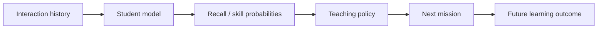

# Learning Engine

## Goal

Estimate what the learner can retrieve **now** and choose study actions that improve future retention.

These are separate problems:



A better predictor does not automatically imply a better teaching policy.

## Recognition is not recall

Record evidence mode explicitly.

Initial modes:

1. recognition
2. recall
3. application
4. structural reconstruction

Treat these initially as **assessment/evidence modes**, not proven independent latent abilities.

## Deterministic student state (`heuristic-v1`)

V1 ships a small, pure, deterministic state layer before any trained model. It is
deliberately named `heuristic-v1`, not "mastery".

- Accepted `learning_events` are authoritative. `user_concept_state` is a
  derived cache keyed by `(user, certification version, concept, assessment
  mode)`.
- A newly accepted event updates one cache row per authored
  `ConceptWeight`. Replayed/duplicate events never advance state twice, and
  anonymous demo attempts never create user state.
- The update is bounded and uses the server-scored partial score, the authored
  concept weight, the server-derived attempt number, hints, the assessment mode,
  and timestamps. Recovery attempts and hinted successes contribute less
  evidence than first-attempt, unaided successes.
- Retrievability/forgetting is computed **on read** at selection time from the
  stored evidence mass and last-practiced time. More evidence decays more slowly
  (stability grows with evidence mass), and stored rows are never aged in place.
- Constants live in `crates/domain/src/concept_state.rs` and are covered by
  unit tests. Persistence is `crates/db/src/concept_state.rs`.

The update function is intentionally replaceable: HLR/FSRS/DAS3H and prerequisite
remediation (joined through `KnowledgeNode::concept_ids`) can later replace it
without changing the storage contract or invalidating accepted history.

## Knowledge components

Each question maps to one or more concepts/skills with optional weights.

Example:

```text
PCA pipeline boss
imputation     0.10
encoding       0.15
scaling        0.20
PCA            0.25
KMeans         0.20
data leakage   0.10
```

## Interaction features

Record:

```text
learner
question
concepts
assessment mode
interaction type
score / partial score
structured errors
response time
attempts
hints
item difficulty
spacing/history features
```

### Response-time safeguards

Response time is noisy.

- pause/background time when detectable
- log-transform durations
- cap/winsorize extreme values
- do not equate slow response with weak knowledge without context

## Model roadmap

### Baselines

Benchmark all three before deep KT:

1. **HLR** — interpretable forgetting baseline
2. **FSRS** — mature engineering baseline for single-item spaced repetition
3. **DAS3H-style model** — multi-skill + temporal forgetting

FSRS is not the final product model because it does not directly model multi-concept technical problems or rich error structure; it is a useful scheduler/memory baseline.

### Later candidates

Only after substantial real data:

- DKT/RNN
- AKT
- LefoKT or other forgetting-aware KT
- content-aware models such as KARL-like approaches

Adopt a deep model only if it materially improves the app's own held-out data and downstream teaching outcomes.

## Student-model evaluation

Primary:

- Brier score
- log loss
- calibration plots / ECE
- AUC secondary

Evaluation matrix:

| Split | Tests |
|---|---|
| within-user temporal holdout | normal future prediction |
| new-user holdout | cold start |
| new-item holdout | unseen questions |
| new-concept holdout | concept generalization |
| certification holdout | cross-domain transfer |
| mode slices | recognition vs recall etc. |

Avoid random row splits that leak future behavior.

## Teaching-policy evaluation

Do not auto-promote a scheduler because the predictor's Brier score improved.

Measure:

- delayed recall
- learning gain per minute
- exam-objective coverage
- review burden
- voluntary return rate
- learner override rate

Use online experiments when enough traffic exists.

## Scheduling utility

Candidate utility may combine:

```text
forgetting risk
* exam objective weight
* prerequisite value
* uncertainty/information gain
* transfer value
* variety penalty
```

Then satisfy session constraints such as duration and interaction diversity.

## V1 planner (optional, deterministic)

The first planner is a small pure function, `PlannerInput -> Recommendation`,
implemented in `apps/api/src/planner.rs`. It is track-agnostic: a Learning Track
may be a vendor certification or a general track such as Python Fluency, Python
Data Stack, or PyTorch Core. It never hard-codes an exam or vendor.

Actions:

- `learn_node` — study a knowledge-map node the learner has not explored.
- `review_node` — revisit a node for a strong but stale concept.
- `practice_question` — answer a retrieval-practice question.
- `practice_domain` — take a domain/topic review.

Stable reason codes explain each choice: `cold_start`, `weak_concept`,
`weak_prerequisite`, `needs_practice`, `stale_knowledge`, `domain_review`, and
`strong_and_fresh`. Rules are evaluated in a fixed order, so identical input
produces an identical recommendation:

```text
cold start
-> weak prerequisite before a weak dependent concept
-> weak, unexplored node with little evidence
-> weak, already-explored concept -> retrieval practice
-> strong but stale concept -> review
-> strong and fresh -> harder/applied practice or a domain review
```

Inputs are the derived `heuristic-v1` concept state, recent accepted events,
question `ConceptWeight`/assessment mode/difficulty, knowledge nodes and their
module/node prerequisites, and optional client discovery progress. Assessment
modes stay distinct: a practice candidate is scored against the state for the
question's own mode, so strength in recognition never hides weakness in
application.

### Discovery semantics match the Knowledge Map

Raw client discovery progress is sent with the recommendation request
(`POST /v1/tracks/{track_id}/recommendation`). The server derives unlocked nodes
and completed modules with the same rules the frontend Knowledge Map uses
(`crates/content/src/discovery.rs`): a module is available only when every
prerequisite module is **complete** (every node unlocked), and a node is
available only when its module is available and every node prerequisite is
unlocked. The planner never targets a node the map still shows as locked.

### Executing a recommendation

- `learn_node` / `review_node` open the exact recommended Knowledge Node.
- `practice_question` starts a focused `recommended_practice` mission. The
  server validates the anchor question against canonical content, places it
  first, and selects the related questions itself from authored concept overlap
  (deterministic, repeat-aware). The client never supplies the related ids.
- `practice_domain` starts the normal adaptive `domain_quiz`.

Existing Quick Quiz, Domain Quiz, Full Practice, and Task Practice behavior is
unchanged.

### Lifecycle telemetry

Each recommendation carries a stable `recommendation_id`. Generation is logged
when the recommendation is computed; lifecycle stages (`shown`, `clicked`,
`started`, `node_opened`, `completed`) are reported to
`POST /v1/tracks/{track_id}/recommendations/{recommendation_id}/events`. A
recommendation request is never treated as proof it was shown.

All recommendation and telemetry persistence is auxiliary and best-effort. It
never shares a transaction with learning-event persistence, and a failure can
never block the dashboard, knowledge maps, quizzes, mission creation, answer
submission, or sync. Only accepted, scored learning events change concept state.

## V1 session planning

Beyond a single next action, the same concept model plans a short study session:
an ordered list of activities for a Learning Track. The pure core is
`planner::session::plan_session` (`apps/api/src/planner/session.rs`), exposed at
`POST /v1/tracks/{track_id}/session` with `available_minutes` and a preference
(`balanced`, `more_practice`, `more_learning`).

Activities reuse existing execution paths:

- `learn_node` / `review_node` open the exact Knowledge Node.
- `practice` carries server-selected `question_ids`; the client only anchors a
  `recommended_practice` mission on the first one. The client never submits
  arbitrary question ids.
- `practice_domain` starts the normal adaptive domain quiz.

V1 is deterministic. It orders learning/prerequisite activities before retrieval
and finishes with retrieval practice, balances weak concepts, forgetting risk,
difficulty fit, domain coverage, interaction variety, and recent-question
avoidance, and trims the plan to stay near the requested time. The single
"Recommended next" feature is unchanged and independent.

Session planning is optional. If the endpoint fails, times out, returns malformed
data, or returns nothing usable, the frontend builds a **standard non-adaptive
session** from already-loaded track content (domains in authored order, mixing
domain learning and practice). The fallback never calls the adaptive API and
never needs learner state, so a learner can always start a session. Adaptive
sessions can be adjusted with small planning overrides (shorter, more practice,
more learning, regenerate) that are preferences, not mastery evidence.

`study_session_log` records generated sessions as auxiliary telemetry; it is not
learning evidence and a persistence failure never prevents a session from being
returned.

## Daily Missions (V1)

The learner-facing plan is a single, stable **Daily Mission** per track and
canonical UTC day. It is generated once and stored immutably in
`daily_missions` / `daily_mission_items`; completing items, answering questions,
concept-state changes, refreshing, navigating away, or re-requesting the
endpoint never regenerate or reorder it. Tomorrow's mission is generated from
the learner's latest state.

Generation reuses the session planner (`planner::session::plan_session`) with a
roughly 20-minute, balanced plan, then persists the complete activity list and
position order, including the server-selected question ids for `practice`
activities. Activities are `learn_node`, `review_node`, `practice`, and
`domain_practice`.

Execution reuses existing primitives:

- `learn_node` / `review_node` are completed when the Knowledge Node reaches its
  normal completion condition, re-derived server-side from discovery progress.
  Opening the node alone does not complete it.
- `practice` / `domain_practice` start a normal mission whose completion marks
  the item complete. The client never chooses canonical question ids.

If adaptive generation fails when today's mission is first created, a
**standard non-adaptive** plan is generated from authored track content (domain
order, available learning nodes, domain practice), persisted with
`plan_type = standard`, and kept for the rest of the day. It never reads concept
state or adaptive APIs, and it is not silently replaced later.

Progress is server-authoritative and survives navigation, refresh, and
reopening the app; the runner resumes the first incomplete item. Completing all
items marks the mission complete and settles a single idempotent
`daily_mission_complete` Bits bonus (see `DAILY_MISSION_BONUS_BITS`), awarded at
most once even under retries or concurrent requests. Daily Mission completion is
never concept/mastery evidence; only scored learning events change knowledge
state.

## Plan explanation

Example:

> VPC routing moved ahead of IAM because IAM recall was stronger than predicted, while VPC troubleshooting has higher exam weight and increasing forgetting risk.

User can:

- accept
- choose lighter/harder alternative
- replace one activity
- keep original plan

## Learner quiz modes

The learner sees three quiz modes. Tactile interaction types are implementation
and scoring primitives underneath them, not learner-facing choices.

| Mode | Questions | Purpose |
|---|---:|---|
| Quick Quiz | 10 | adaptive cross-domain practice |
| Domain Quiz | ~20 | one exam domain, spread across tasks |
| Full Practice | 65 | weighted full-certification coverage |

V1 selection is an explainable heuristic (`apps/api/src/selection.rs`), not a
trained student model. It reads the derived per-concept state (estimate,
uncertainty, forgetting risk, evidence mass) and the authored `ConceptWeight`
mappings, then ranks candidates by concept weakness, forgetting risk, domain
weight, uncertainty, difficulty fit, novelty, and an immediate-repeat penalty,
with a deterministic question-id tie-break. Difficulty fit makes weak concepts
tend toward easier suitable questions and strong concepts toward harder ones.

Cold start falls back to accepted history when no derived state exists yet, then
to the neutral prior, so the modes still work for a brand-new learner. Quick Quiz
covers domains by official weight; Domain Quiz spreads across tasks; Full
Practice allocates seats by domain weight using a deterministic largest-remainder
method and redistributes any deficit when a domain is short. Question counts are
server policy and are never client input.

## References

See [REFERENCES.md](REFERENCES.md).
