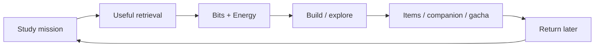

# Gamification Plan

## Purpose

Gamification should increase useful return frequency without rewarding low-value behavior.



## Currencies

### Bits

Spendable game currency earned from meaningful learning. Spend on cosmetics,
building, companion items, exploration actions, and some earned gacha.

Bits are not mastery. Mastery/readiness and currency are separate concepts.

### Energy

Earned through study. Used only for game-world actions.

**Energy never blocks studying.**

### Mastery / XP

Non-spendable progress. Never imply XP equals knowledge mastery.

## Reward invariant

The reward system must not make intentional failure optimal.

For the same question and frozen pre-attempt state:

```text
reward(first-attempt success)
>= reward(failure -> unaided recovery)
>  reward(failure -> reveal/skip)
```

Recovery bonus should reduce the cost of a mistake, not outperform first-pass success.

## Reward calculation

Freeze challenge/difficulty before the first attempt.

V1 Bits policy (`crates/domain/src/reward.rs`):

```text
first attempt, fully correct:
    base 10 + round(difficulty_prior * 6)   (0..6 bonus)

later attempt, fully correct (recovery):
    half of the full reward, minimum 1

not fully correct:
    0 Bits, never negative

section quiz completion (once per learner and section):
    +20 Bits
```

Settlement is server-authoritative and idempotent: the reward is written with
the accepted learning event in one transaction, keyed by `event_id`, so a
retried sync cannot award the same attempt twice. A `bits_preview` is shown for
immediate feedback. For ordinary study missions the client may compute that
preview locally, but it is display-only and is neither persisted as settled
currency nor trusted by the server; only sync settles the wallet balance.

A section quiz's completion bonus is separate from per-answer Bits and settles
at most once per `(user, track version, domain, module)`, even if the section
quiz is retaken. It requires accepted evidence for the mission's question, so
marking a mission complete without answering cannot mint Bits. The `Daily
Mission` completion bonus follows the same once-only pattern.

Conceptually:

```text
reward =
base
* pre_attempt_challenge
* retrieval_value
* novelty
* anti_farm_multiplier
```

Do not let the current failure lower mastery and immediately increase the same question's reward.

## Anti-farming

- diminishing rewards for repeated/easy items
- challenge derived from server-side pre-mission state
- capped reward across repeated attempts
- canonical server scoring
- idempotent mission settlement
- anomaly detection for impossible speed/volume
- no reward for replaying an already-settled mission

The fastest way to earn should remain useful learning.

## Persistent world

Suggested zones:

```text
Tech Campus
├── Cloud District
├── Systems Lab
├── AI Research Center
├── Math Observatory
└── Security Operations Center
```

Buildings use both:

- mastery/campaign milestones
- spendable resources

Mastery milestones cannot be purchased.

## Anime companion

Companion roles:

- presents today's recommendation
- explains plan changes
- reacts to recovery/mastery
- participates in exploration
- receives cosmetic/story unlocks

Use authored/template dialogue first; no LLM required for routine interaction.

## Gacha

V1:

- earned-only currency/tickets
- published odds
- pity guarantee
- duplicate conversion
- daily small mystery reward
- weekly larger reward
- no required power item
- no real-money randomized rewards

If monetized randomized items are ever introduced, perform legal and app-store review first.

## Missions

| Mode | Target | Style |
|---|---:|---|
| Quick | 3 min | connection/sort-heavy |
| Standard | 6-8 min | balanced |
| Memory | 6-8 min | reconstruction/recall-heavy |
| Boss | 8-12 min | integrated application |
| Relaxed | 6-10 min | no timer; more support |

The learning engine chooses **what** by default. The learner may choose **how**.

## Accessibility

Every interaction needs a non-drag alternative:

- keyboard select/place
- tap A -> tap B for connections
- reduced-motion mode
- no color-only correctness signal
- timer-off mode
- large touch targets
- screen-reader labels where feasible

PWA V1 should rely on visual/audio satisfaction. iPhone web haptics are not dependable; native packaging can add real haptic APIs later.

## Feedback feel

Correct answers draw an animated checkmark, and earned Bits fly into the wallet
HUD as a small particle burst with a bright coin chime. Mission completion sends
its earned Bits to the wallet the same way, and a checklist step completing plays
a crisp tick. Sounds are synthesized (no audio assets), follow the existing mute
preference, and are throttled; every animation degrades to a static, equally
informative state under `prefers-reduced-motion` (sound still plays). The reward
is never gated on the animation succeeding: the wallet balance updates
independently and the animation is decorative.

## Momentum

Prefer gentle momentum over destructive streaks.

- regular study raises momentum
- inactivity decays gently
- no earned item is destroyed
- return flow offers a short recovery mission

## Evidence

Gamification effects are heterogeneous. Treat game mechanics as an engagement hypothesis and measure delayed learning outcomes separately.

See [REFERENCES.md](REFERENCES.md).
