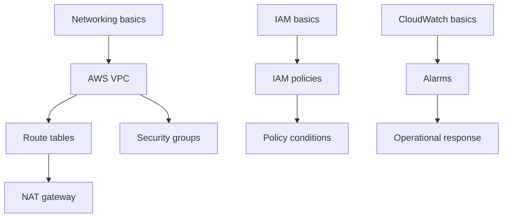

# Certification Content

## Goal model

A campaign is tied to a **versioned exam blueprint**.

```text
Certification
└── ExamVersion
    ├── effective dates
    ├── official objectives
    ├── objective weights
    ├── concepts
    ├── prerequisite graph
    └── question/content bundle versions
```

Reason: certification vendors change objectives. Mastery history must remain interpretable after an exam revision.

## Initial content strategy

Start with 1-2 certifications where:

- official objectives are explicit
- concepts overlap with reusable technical knowledge
- learner demand is high
- content can be authored/tested without proprietary exam dumps

Do not start with six ecosystems simultaneously.

## Content sources

Allowed:

- official exam guides/objectives
- official product/service documentation
- original explanations
- original practice questions
- public standards/specifications where licensing permits

Do not ingest:

- leaked exam dumps
- copied proprietary questions
- copyrighted course banks without permission

## Knowledge graph

Example:



Prerequisites help distinguish:

> "forgot target concept"

from:

> "target mistakes are driven by a weak prerequisite"

## Question authoring schema

Each question needs:

```text
id
exam version
objective
concept weights
assessment mode
interaction type
difficulty prior
prompt/content
correct structure
structured error codes
explanation
hints
source references
```

## Learning modules (knowledge maps)

Quiz bundles and learning content are distinct first-class content types:

```text
content/<category>/<certification>/<version>/
├── learning/            # LearningDomain knowledge maps (pre-quiz)
│   └── learning-domain-1.json
└── questions/           # ContentBundle quiz content (scored)
    └── domain-1.json
```

The build discovers learning sources by path (`**/learning/**/*.json`) and quiz
sources as every other JSON file, so neither can be silently parsed as the
other. `ContentRegistry` validates and exposes both; it does not merge them.

Each `LearningDomain` contains ordered `LearningModule`s of `KnowledgeNode`s.
A node carries `concept_ids` (the bridge to quiz evidence), authored
`prerequisite_node_ids` and `map_position`, and progressive `prompts` whose
`reveal` is one of `text`, `sequence`, `bullets`, `keywords`, or `comparison`.

Rules:

- Learning is a discovery layer before retrieval practice, not a fourth quiz
  mode. Reveals are **never** scored and do not create `learning_event` rows.
- Discovery progress (`adaptive-learn.learning-progress.v1` in local storage)
  stores only revealed prompt ids. Node and module state are derived, so
  progress cannot drift from the curriculum and stale ids are ignored.
- A node is `unlocked` when every required prompt is revealed. `ready`,
  `in_progress`, and `locked` are derived from node prerequisites, module
  prerequisites, and reveals.
- Vocabulary stays game-like: Knowledge Map, Knowledge Node, Locked, Ready,
  Discover, Unlocked, Path Unlocked, Module Complete, Continue Exploring,
  Discovery Progress. Do not say "Mastered" for exploration.
- The API exposes it at
  `GET /v1/certifications/{certification_id}/domains/{domain_id}/learning`.
  Reveals are included because progressive disclosure is the mechanic; quiz
  canonical answers are never included.

Validation fails loudly on malformed maps: duplicate module/node/prompt ids,
unknown or self prerequisites, dependency cycles, invalid map positions,
missing required prompts, incomplete reveal payloads, coverage counts that do
not match the authored shape, and concept/task ids that do not exist in the
quiz bundle for the same certification version.

## Interaction schema

Interactions are authored as Serde-tagged JSON. `interaction` and
`canonical_answer` share a `type` discriminator:

| `type` | Assessment mode | Learner task |
|---|---|---|
| `classification` | recognition | place items into categories |
| `ordering` | procedural_recall | arrange items in order |
| `node_connection` | relationship_recall | draw directed relationships |
| `reconstruction` | structural_reconstruction | place pieces into a slot-based scaffold |
| `evidence_selection` | application | select the relevant evidence sources |
| `spot_the_fault` | application | flag the faulty configuration element(s) |
| `fill_slots` | recall / procedural_recall | fill blanks from a constrained option set |
| `troubleshooting` | application | work through a diagnosis/remediation decision tree |
| `scenario_choice_chain` | application | work through an authored decision chain |
| `configuration_builder` | application | assign components to named roles |
| `two_dimensional_placement` | application | place items on a two-axis conceptual map |
| `command_assembly` | procedural_recall | assemble an ordered statement from tokens |
| `typed_fill_blank` | recall | type missing text into prose, code, or table blanks |

Design constraints:

- `interaction` never contains the answer key; `canonical_answer` is only
  returned after server-side scoring.
- Answer values are ids, never free text, except `typed_fill_blank`. That type
  grades free text deterministically against explicitly authored aliases; every
  other interaction submits ids. No runtime LLM grading is used.
- Component pools, options, and evidence lists may contain distractors.
  Learner-facing labels must never encode answer metadata such as
  `(distractor)`, `(correct)`, or `(wrong)`.
- Every interaction must have a non-drag alternative and must not signal
  correctness by color alone.
- Branching interactions are deterministic; the client collects the learner's
  decision path locally and the server validates it against authored
  transitions. No per-step network call is made.
- Boss battles are a **composition** of normal interactions grouped by the
  mission layer, not an `Interaction` variant. This keeps a separate evidence
  signal for each skill.

Scoring is server-authoritative and partial where it produces useful evidence:

- `classification`: correct placements / items.
- `ordering`: correct positions.
- `node_connection`: correct edges minus invalid edges.
- `reconstruction`: for a `linear` scaffold, correctly filled slots divided by
  required slots — slot order encodes relationships, so no edges are required
  and unused distractors are never penalized. For a `graph` scaffold, authored
  slot positions are only a display scaffold: placement score is the number of
  required pieces present (wherever they sit), so swapping two pieces between
  slots is not penalized when the relationships are unchanged. Placement and
  topology are combined as `0.7 * placements + 0.3 * topology`, where topology
  is correct edges minus invalid edges. Structured errors distinguish
  `reconstruction_wrong_component`, `reconstruction_wrong_position` (linear
  only), `reconstruction_missing_component`, `reconstruction_unfilled_slot`,
  and, for graph layouts, `reconstruction_missing_relationship` /
  `reconstruction_invalid_relationship`.
- `evidence_selection`: correct selections minus false positives, over the
  number of relevant sources.
- `spot_the_fault`: faults found minus false positives, over the number of
  faults.
- `fill_slots`: correct slots / slots.
- `troubleshooting` / `scenario_choice_chain`: correct decisions minus wrong
  decisions, over the length of the expected path. Error codes are namespaced
  per stage (`*_wrong_diagnosis`, `*_wrong_next_action`, `*_wrong_remediation`)
  plus `*_incomplete_path`.
- `configuration_builder`: correct role assignments minus unnecessary
  components, over the number of required roles.
- `two_dimensional_placement`: correct item-axis placements over all
  item-axis pairs, using tolerant canonical regions rather than exact points.
- `command_assembly`: correct slots / slots, with separate codes for wrong
  tokens, missing tokens, and tokens in the wrong position.
- `typed_fill_blank`: correct blanks / blanks. A blank is correct only when its
  normalized typed answer exactly matches one of the authored accepted answers.
  All blanks must be correct for the whole question to be correct. Error codes
  are `typed_fill_blank_incorrect` and `typed_fill_blank_incomplete`.

## Typed fill in the blank

`typed_fill_blank` tests active recall: the learner types the missing word,
phrase, service, value, or code directly into one or more blanks. Use
`assessment_mode: "recall"`.

Presentation is explicit and tagged. The renderer never guesses whether content
is prose, code, or a table; `interaction.content.type` selects one of three
presentation contexts:

| `content.type` | Use |
|---|---|
| `text` | prose with `{{slot_id}}` blanks |
| `code` | syntax-highlighted source code with `{{slot_id}}` blanks |
| `table` | a table whose cells are `text` or `code` templates |

Blanks are always written as `{{slot_id}}` inside a template. Across all
templates of one interaction, each placeholder must resolve to a declared slot,
each slot must appear **exactly once**, and `canonical_answer.answers` must
contain exactly those slot ids. Repeated placeholder references are rejected
rather than silently binding two inputs to one answer.

### Text

```json
{
  "assessment_mode": "recall",
  "interaction_type": "typed_fill_blank",
  "prompt": "Complete the statement.",
  "interaction": {
    "type": "typed_fill_blank",
    "content": {
      "type": "text",
      "template": "An explicit {{policy_result}} overrides an Allow during IAM policy evaluation."
    },
    "slots": [
      {
        "id": "policy_result",
        "label": "Policy result",
        "placeholder": "Type your answer"
      }
    ]
  },
  "canonical_answer": {
    "type": "typed_fill_blank",
    "answers": {
      "policy_result": { "accepted_answers": ["deny", "explicit deny"] }
    }
  }
}
```

### Code

Code templates preserve newlines and indentation. `language` selects the
highlighter grammar and must not be blank.

```json
{
  "interaction": {
    "type": "typed_fill_blank",
    "content": {
      "type": "code",
      "language": "python",
      "template": "optimizer.{{zero}}()\nloss.backward()\noptimizer.{{step}}()"
    },
    "slots": [
      { "id": "zero", "label": "Clear gradients", "placeholder": "method" },
      { "id": "step", "label": "Update parameters", "placeholder": "method" }
    ]
  },
  "canonical_answer": {
    "type": "typed_fill_blank",
    "answers": {
      "zero": { "accepted_answers": ["zero_grad"] },
      "step": { "accepted_answers": ["step"] }
    }
  }
}
```

Blanks may sit inside function arguments, strings, or with punctuation touching
them (`dim={{dim}}`). The blank is rendered exactly where `{{slot_id}}` appears
inside the highlighted code, never as a separate field below it.

A bare `}}` that is not part of a placeholder is treated as literal text, so
code that naturally contains closing braces (nested dictionaries, blocks) is
valid. Only an unterminated or malformed `{{...}}` is rejected.

### Table

Tables render as real `<table>` markup. Each row must provide a cell for every
column and must not provide cells for unknown columns. A cell is either a `text`
or a `code` template, and code cells reuse the same code renderer as standalone
code questions.

```json
{
  "interaction": {
    "type": "typed_fill_blank",
    "content": {
      "type": "table",
      "columns": [
        { "id": "goal", "label": "Goal" },
        { "id": "api", "label": "PyTorch code" }
      ],
      "rows": [
        {
          "id": "clear-gradients",
          "cells": {
            "goal": { "type": "text", "template": "Clear accumulated gradients" },
            "api": {
              "type": "code",
              "language": "python",
              "template": "optimizer.{{zero}}()"
            }
          }
        },
        {
          "id": "backward",
          "cells": {
            "goal": { "type": "text", "template": "Backpropagate the loss" },
            "api": {
              "type": "code",
              "language": "python",
              "template": "loss.{{backward}}()"
            }
          }
        }
      ]
    },
    "slots": [
      { "id": "zero", "label": "Clear gradients", "placeholder": "method" },
      { "id": "backward", "label": "Backward method", "placeholder": "method" }
    ]
  },
  "canonical_answer": {
    "type": "typed_fill_blank",
    "answers": {
      "zero": { "accepted_answers": ["zero_grad"] },
      "backward": { "accepted_answers": ["backward"] }
    }
  }
}
```

`placeholder` is optional; when omitted the UI falls back to a generic hint. The
order blanks are displayed follows their position in the content (template
order, then table row/column order), not the order of the `slots` array.

### Syntax highlighting

Code is highlighted client-side with a locally bundled
[Prism](https://prismjs.com/) instance. Only the supported languages are
registered: `python`, `rust`, `bash`, `json`, `yaml`, `javascript`,
`typescript`, and `sql`. Aliases such as `py`, `sh`, `yml`, `js`, and `ts` are
normalized. An unknown language still renders as monospace code with working
blanks, just without colors.

Highlighting is display-only. Authored code is never executed or evaluated, and
is never injected as raw HTML. There is no server round trip, no external
service, and no LLM call to render a question.

### Normalization and matching

Answers are authored and matched deterministically, never by an LLM:

- Trim leading/trailing whitespace.
- Lowercase with Unicode-aware case folding.
- Collapse repeated internal whitespace.
- Ignore harmless trailing punctuation (`.`, `,`, `;`, `:`, `!`, `?`).

A blank is correct only when the normalized typed answer equals a normalized
accepted answer. There is no edit-distance or semantic matching, so textually
similar but technically different answers stay distinct: `SQS` does **not**
match `SNS`, and `ALB` does **not** match `NLB`. Aliases such as `Amazon SQS`,
`SQS`, and `Amazon Simple Queue Service` must be authored explicitly in
`accepted_answers`; they are never inferred.

### Validation

A bundle is rejected when:

- a `{{slot}}` placeholder has no matching slot definition;
- a declared slot is never referenced in any template (or is referenced twice);
- a placeholder is malformed, for example an unclosed `{{` or an id containing
  whitespace or braces;
- slot ids are duplicated;
- a `text` or `code` template is empty;
- a `code` template has a blank `language`;
- a table has no columns or no rows;
- a table column or row id is empty or duplicated;
- a row is missing a cell for a declared column, or has a cell for an unknown
  column;
- the canonical answer is missing a slot, or references an unknown slot;
- `accepted_answers` is empty, or an alias is empty or whitespace-only;
- the interaction and canonical-answer types do not match;
- `interaction_type` and `interaction.type` do not match.

Hints come from the shared `hints` list and never reveal an accepted answer.


## Certification planning

Inputs:

- exam date
- available minutes/day
- diagnostic result
- objective weights
- concept graph

Planner produces:

```text
foundation
-> gap closure
-> mixed application
-> boss/scenario practice
-> weak-area stabilization
-> final simulated exams
```

Replan after evidence changes.

## Readiness

Do not display a single unsupported "90% chance to pass."

Display:

- objective coverage
- calibrated recall/application estimates
- practice exam performance
- uncertainty
- remaining high-risk concepts

If a pass-probability model is later built, validate it against real exam outcomes before surfacing it.

## Freshness operations

Track per exam version:

```text
vendor
official blueprint URL
effective date
last checked
next review date
content version
deprecated concepts
```

Run a manual/automated diff when a vendor changes its official blueprint. Never silently remap historical mastery to a new exam version.

## Trademark and licensing

Before launch:

- review vendor trademark/logo rules
- do not imply AWS/Microsoft/Google/Linux Foundation endorsement
- retain source/license metadata for authored content
- do not use leaked exam dumps or copied proprietary item banks
