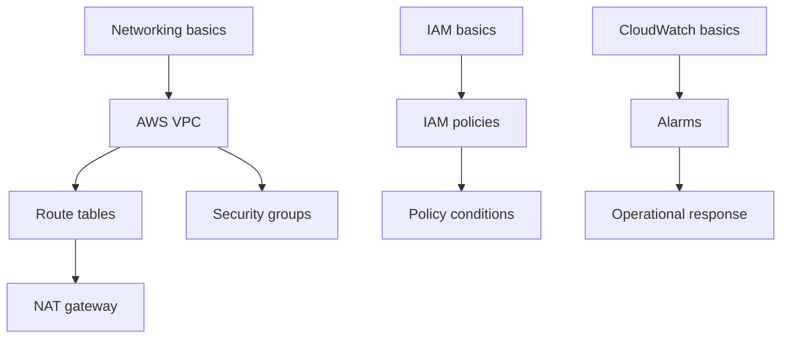

# Certification Content

## Goal model

A campaign is tied to a **versioned exam blueprint**.

```text
Certification
└── ExamVersion
    ├── effective dates
    ├── official objectives
    ├── objective weights
    ├── concepts
    ├── prerequisite graph
    └── question/content bundle versions
```

Reason: certification vendors change objectives. Mastery history must remain interpretable after an exam revision.

## Initial content strategy

Start with 1-2 certifications where:

- official objectives are explicit
- concepts overlap with reusable technical knowledge
- learner demand is high
- content can be authored/tested without proprietary exam dumps

Do not start with six ecosystems simultaneously.

## Content sources

Allowed:

- official exam guides/objectives
- official product/service documentation
- original explanations
- original practice questions
- public standards/specifications where licensing permits

Do not ingest:

- leaked exam dumps
- copied proprietary questions
- copyrighted course banks without permission

## Knowledge graph

Example:



Prerequisites help distinguish:

> "forgot target concept"

from:

> "target mistakes are driven by a weak prerequisite"

## Question authoring schema

Each question needs:

```text
id
exam version
objective
concept weights
assessment mode
interaction type
difficulty prior
prompt/content
correct structure
structured error codes
explanation
hints
source references
```

## Interaction schema

Interactions are authored as Serde-tagged JSON. `interaction` and
`canonical_answer` share a `type` discriminator:

| `type` | Assessment mode | Learner task |
|---|---|---|
| `classification` | recognition | place items into categories |
| `ordering` | procedural_recall | arrange items in order |
| `node_connection` | relationship_recall | draw directed relationships |
| `reconstruction` | structural_reconstruction | place pieces into a slot-based scaffold |
| `evidence_selection` | application | select the relevant evidence sources |
| `spot_the_fault` | application | flag the faulty configuration element(s) |
| `fill_slots` | recall / procedural_recall | fill blanks from a constrained option set |
| `troubleshooting` | application | work through a diagnosis/remediation decision tree |
| `scenario_choice_chain` | application | work through an authored decision chain |
| `configuration_builder` | application | assign components to named roles |
| `two_dimensional_placement` | application | place items on a two-axis conceptual map |
| `command_assembly` | procedural_recall | assemble an ordered statement from tokens |

Design constraints:

- `interaction` never contains the answer key; `canonical_answer` is only
  returned after server-side scoring.
- Answer values are ids, never free text. No runtime LLM grading is used.
- Component pools, options, and evidence lists may contain distractors.
  Learner-facing labels must never encode answer metadata such as
  `(distractor)`, `(correct)`, or `(wrong)`.
- Every interaction must have a non-drag alternative and must not signal
  correctness by color alone.
- Branching interactions are deterministic; the client collects the learner's
  decision path locally and the server validates it against authored
  transitions. No per-step network call is made.
- Boss battles are a **composition** of normal interactions grouped by the
  mission layer, not an `Interaction` variant. This keeps a separate evidence
  signal for each skill.

Scoring is server-authoritative and partial where it produces useful evidence:

- `classification`: correct placements / items.
- `ordering`: correct positions.
- `node_connection`: correct edges minus invalid edges.
- `reconstruction`: for a `linear` scaffold, correctly filled slots divided by
  required slots — slot order encodes relationships, so no edges are required
  and unused distractors are never penalized. For a `graph` scaffold, authored
  slot positions are only a display scaffold: placement score is the number of
  required pieces present (wherever they sit), so swapping two pieces between
  slots is not penalized when the relationships are unchanged. Placement and
  topology are combined as `0.7 * placements + 0.3 * topology`, where topology
  is correct edges minus invalid edges. Structured errors distinguish
  `reconstruction_wrong_component`, `reconstruction_wrong_position` (linear
  only), `reconstruction_missing_component`, `reconstruction_unfilled_slot`,
  and, for graph layouts, `reconstruction_missing_relationship` /
  `reconstruction_invalid_relationship`.
- `evidence_selection`: correct selections minus false positives, over the
  number of relevant sources.
- `spot_the_fault`: faults found minus false positives, over the number of
  faults.
- `fill_slots`: correct slots / slots.
- `troubleshooting` / `scenario_choice_chain`: correct decisions minus wrong
  decisions, over the length of the expected path. Error codes are namespaced
  per stage (`*_wrong_diagnosis`, `*_wrong_next_action`, `*_wrong_remediation`)
  plus `*_incomplete_path`.
- `configuration_builder`: correct role assignments minus unnecessary
  components, over the number of required roles.
- `two_dimensional_placement`: correct item-axis placements over all
  item-axis pairs, using tolerant canonical regions rather than exact points.
- `command_assembly`: correct slots / slots, with separate codes for wrong
  tokens, missing tokens, and tokens in the wrong position.


## Certification planning

Inputs:

- exam date
- available minutes/day
- diagnostic result
- objective weights
- concept graph

Planner produces:

```text
foundation
-> gap closure
-> mixed application
-> boss/scenario practice
-> weak-area stabilization
-> final simulated exams
```

Replan after evidence changes.

## Readiness

Do not display a single unsupported "90% chance to pass."

Display:

- objective coverage
- calibrated recall/application estimates
- practice exam performance
- uncertainty
- remaining high-risk concepts

If a pass-probability model is later built, validate it against real exam outcomes before surfacing it.

## Freshness operations

Track per exam version:

```text
vendor
official blueprint URL
effective date
last checked
next review date
content version
deprecated concepts
```

Run a manual/automated diff when a vendor changes its official blueprint. Never silently remap historical mastery to a new exam version.

## Trademark and licensing

Before launch:

- review vendor trademark/logo rules
- do not imply AWS/Microsoft/Google/Linux Foundation endorsement
- retain source/license metadata for authored content
- do not use leaked exam dumps or copied proprietary item banks
