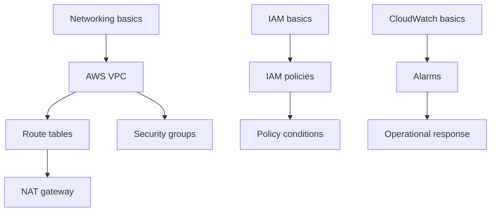

# Certification Content

## Goal model

A campaign is tied to a **versioned exam blueprint**.

```text
Certification
└── ExamVersion
    ├── effective dates
    ├── official objectives
    ├── objective weights
    ├── concepts
    ├── prerequisite graph
    └── question/content bundle versions
```

Reason: certification vendors change objectives. Mastery history must remain interpretable after an exam revision.

## Initial content strategy

Start with 1-2 certifications where:

- official objectives are explicit
- concepts overlap with reusable technical knowledge
- learner demand is high
- content can be authored/tested without proprietary exam dumps

Do not start with six ecosystems simultaneously.

## Content sources

Allowed:

- official exam guides/objectives
- official product/service documentation
- original explanations
- original practice questions
- public standards/specifications where licensing permits

Do not ingest:

- leaked exam dumps
- copied proprietary questions
- copyrighted course banks without permission

## Knowledge graph

Example:



Prerequisites help distinguish:

> "forgot target concept"

from:

> "target mistakes are driven by a weak prerequisite"

## Question authoring schema

Each question needs:

```text
id
exam version
objective
concept weights
assessment mode
interaction type
difficulty prior
prompt/content
correct structure
structured error codes
explanation
hints
source references
```

## Certification planning

Inputs:

- exam date
- available minutes/day
- diagnostic result
- objective weights
- concept graph

Planner produces:

```text
foundation
-> gap closure
-> mixed application
-> boss/scenario practice
-> weak-area stabilization
-> final simulated exams
```

Replan after evidence changes.

## Readiness

Do not display a single unsupported "90% chance to pass."

Display:

- objective coverage
- calibrated recall/application estimates
- practice exam performance
- uncertainty
- remaining high-risk concepts

If a pass-probability model is later built, validate it against real exam outcomes before surfacing it.

## Freshness operations

Track per exam version:

```text
vendor
official blueprint URL
effective date
last checked
next review date
content version
deprecated concepts
```

Run a manual/automated diff when a vendor changes its official blueprint. Never silently remap historical mastery to a new exam version.

## Trademark and licensing

Before launch:

- review vendor trademark/logo rules
- do not imply AWS/Microsoft/Google/Linux Foundation endorsement
- retain source/license metadata for authored content
- do not use leaked exam dumps or copied proprietary item banks
