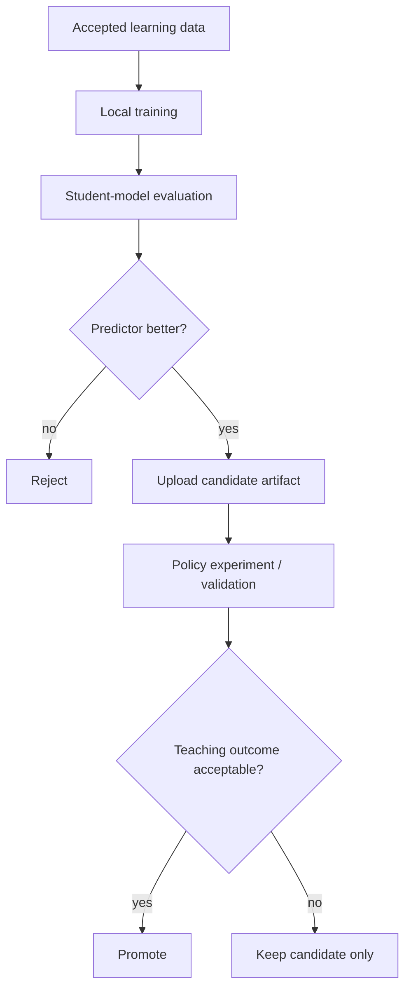

# ML Training and Model Lifecycle

## Initial strategy

Train locally daily while it remains convenient.

> Measurement note: `heuristic-v1` prediction snapshots and their linked
> outcomes are already captured (see `docs/06-learning-engine.md`). They form the
> baseline prediction/outcome dataset that every later model must beat. Pure
> metric functions and an internal aggregate-only evaluation endpoint exist for
> Brier score, log loss, and calibration; no training pipeline is built yet.



Prediction-model promotion and teaching-policy promotion are separate decisions.

## Daily pipeline

1. Build dataset from accepted mission/answer records plus referenced telemetry.
2. Exclude deletion-tombstoned users.
3. Train HLR, FSRS baseline, and DAS3H-style candidates.
4. Evaluate temporal/cold-start/item/concept splits.
5. Check calibration and subgroup regressions.
6. Register candidate artifact if it improves prediction.
7. Do not automatically replace the scheduling policy.
8. Upload immutable artifact + manifest.

## Artifact

```text
models/memory/v000023/
  model.json
  manifest.json
```

Manifest:

```json
{
  "version": "v000023",
  "model_type": "das3h",
  "feature_schema": 4,
  "concept_schema": 7,
  "trained_at": "...",
  "dataset_snapshot": "2026-09-18T00",
  "deletion_filter_version": 12,
  "training_event_count": 183492,
  "metrics": {
    "brier": 0.139,
    "log_loss": 0.426,
    "auc": 0.791
  },
  "previous_version": "v000021"
}
```

Artifacts are immutable. Promotion changes a pointer/manifest.

## Per-user personalization

Do not train one neural model per user.

Use:

```text
global model
+
per-user state/features
```

Global model learns shared effects; user state adapts forgetting and skill estimates immediately.

## Evaluation

### Student model

- Brier score
- log loss
- calibration/ECE
- AUC secondary
- cold-start and unseen-item/concept slices

### Teaching policy

- delayed recall
- learning gain/minute
- objective coverage
- review burden
- return rate

A predictor with better Brier score can still produce a worse scheduler.

## Inference

V1 simple models may run client-side from downloaded parameters.

If later neural KT is too complex:

- batch many candidate concepts in one inference call
- cache results for the session
- no persistent GPU service unless measured value justifies it

## Cloud migration

Move training when:

- local daily run is operationally inconvenient
- training takes ~1 hour or more routinely
- sweeps are constrained
- reproducibility needs managed jobs

Order:

```text
local
-> Modal
-> RunPod / spot GPU
-> dedicated platform only if needed
```

## Reproducibility

Every run records:

```text
git commit
dataset snapshot
feature/concept schema
hyperparameters
random seed
lockfiles
metrics
artifact checksum
```

Add MLflow or another tracker only when a simple metadata table/files becomes insufficient.
